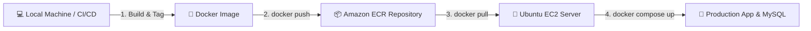

# ☁️ Amazon ECR Container Deployment Guide
## University Maintenance Service Request System (MIT 8333)

This guide details how to publish your application container image to **Amazon Elastic Container Registry (ECR)** and pull/run it on an **Ubuntu EC2 Server**.



---

## 📋 Prerequisites

1. **AWS Account** with permissions to access ECR & EC2.
2. **AWS CLI** installed on your local computer (`aws --version`).
3. **Docker Desktop** installed on your local computer (`docker --version`).

---

## 🏗️ Phase 1: Create ECR Repository (AWS Console or CLI)

### Option A: Create Repository via AWS CLI
```bash
aws ecr create-repository \
  --repository-name miva-maintenance-app \
  --region us-east-1
```
*Note*: Replace `us-east-1` with your AWS region. Note your `repositoryUri` output:
`123456789012.dkr.ecr.us-east-1.amazonaws.com/miva-maintenance-app`

---

## 📤 Phase 2: Build, Tag & Push Image to Amazon ECR (Local Machine)

Execute these commands from your local project root directory:

### Step 1: Authenticate Docker to Amazon ECR
```bash
aws ecr get-login-password --region us-east-1 | docker login --username AWS --password-stdin 123456789012.dkr.ecr.us-east-1.amazonaws.com
```
*(Replace `us-east-1` and `123456789012` with your AWS Region and 12-digit AWS Account ID).*

### Step 2: Build Production Docker Image
```bash
docker build -t miva-maintenance-app .
```

### Step 3: Tag Image for Amazon ECR
```bash
docker tag miva-maintenance-app:latest 123456789012.dkr.ecr.us-east-1.amazonaws.com/miva-maintenance-app:latest
```

### Step 4: Push Image to Amazon ECR
```bash
docker push 123456789012.dkr.ecr.us-east-1.amazonaws.com/miva-maintenance-app:latest
```

---

## 📥 Phase 3: Pull & Deploy Image on Ubuntu EC2 Server

SSH into your Ubuntu Server:
```bash
ssh -i "miva-key.pem" ubuntu@YOUR_EC2_PUBLIC_IP
```

### Step 1: Install AWS CLI on Ubuntu Server
```bash
sudo apt update && sudo apt install -y awscli unzip
```

### Step 2: Authenticate Server Docker to Amazon ECR
```bash
aws ecr get-login-password --region us-east-1 | docker login --username AWS --password-stdin 123456789012.dkr.ecr.us-east-1.amazonaws.com
```

### Step 3: Create ECR Production `docker-compose.yml` on Server
Create a deployment folder on the server:
```bash
mkdir -p ~/miva_production && cd ~/miva_production
nano docker-compose.yml
```
Paste the ECR production `docker-compose.yml` configuration:

```yaml
version: '3.8'

services:
  # MySQL Database Service
  db:
    image: mysql:8.0
    container_name: miva_mysql_db
    restart: always
    environment:
      MYSQL_ROOT_PASSWORD: rootpassword123
      MYSQL_DATABASE: miva_maintenance
      MYSQL_USER: miva_user
      MYSQL_PASSWORD: MivaPassword123!
    ports:
      - "3306:3306"
    volumes:
      - mysql_data:/var/lib/mysql
    healthcheck:
      test: ["CMD", "mysqladmin", "ping", "-h", "localhost"]
      interval: 10s
      timeout: 5s
      retries: 5

  # Next.js Web App Service (Pulling Image from Amazon ECR)
  web:
    image: 123456789012.dkr.ecr.us-east-1.amazonaws.com/miva-maintenance-app:latest
    container_name: miva_web_app
    restart: always
    ports:
      - "3000:3000"
    environment:
      - DATABASE_TYPE=mysql
      - MYSQL_HOST=db
      - MYSQL_PORT=3306
      - MYSQL_USER=miva_user
      - MYSQL_PASSWORD=MivaPassword123!
      - MYSQL_DATABASE=miva_maintenance
      - JWT_SECRET=super-secret-miva-key-12345
    depends_on:
      db:
        condition: service_healthy
    volumes:
      - uploads_data:/app/public/uploads

volumes:
  mysql_data:
    driver: local
  uploads_data:
    driver: local
```

### Step 4: Launch Containers on Server
```bash
docker compose pull
docker compose up -d
```

### Step 5: Verify Deployment
Check running container status:
```bash
docker compose ps
```
Open browser at `http://YOUR_EC2_PUBLIC_IP:3000`.

---

## 🔄 Updating Deployment After Code Changes

Whenever you update your code in the future:

1. **On Local Machine**:
   ```bash
   docker build -t miva-maintenance-app .
   docker tag miva-maintenance-app:latest 123456789012.dkr.ecr.us-east-1.amazonaws.com/miva-maintenance-app:latest
   docker push 123456789012.dkr.ecr.us-east-1.amazonaws.com/miva-maintenance-app:latest
   ```

2. **On Ubuntu EC2 Server**:
   ```bash
   cd ~/miva_production
   docker compose pull
   docker compose up -d
   ```
