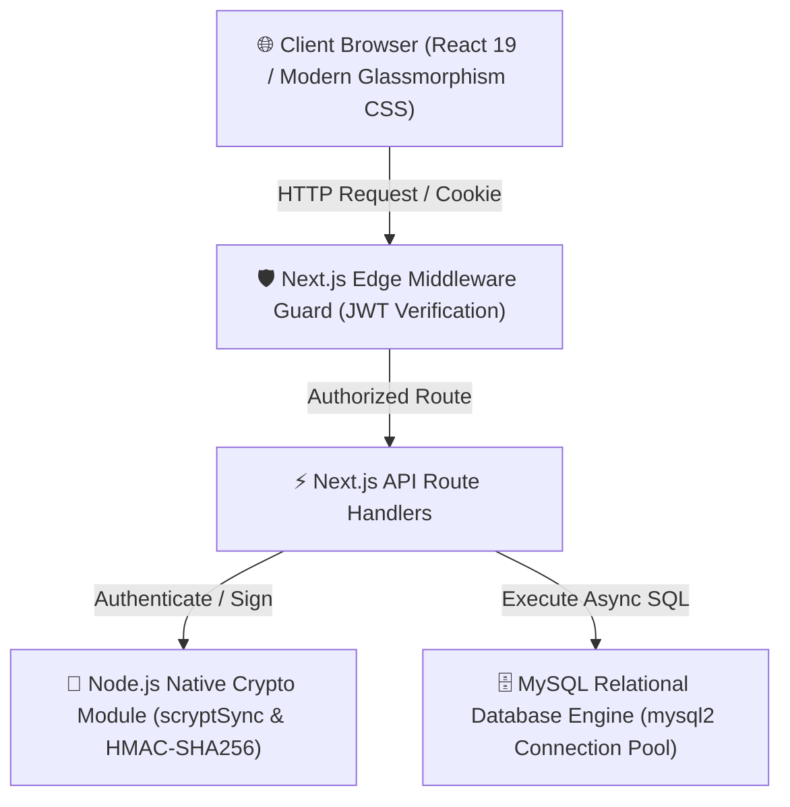
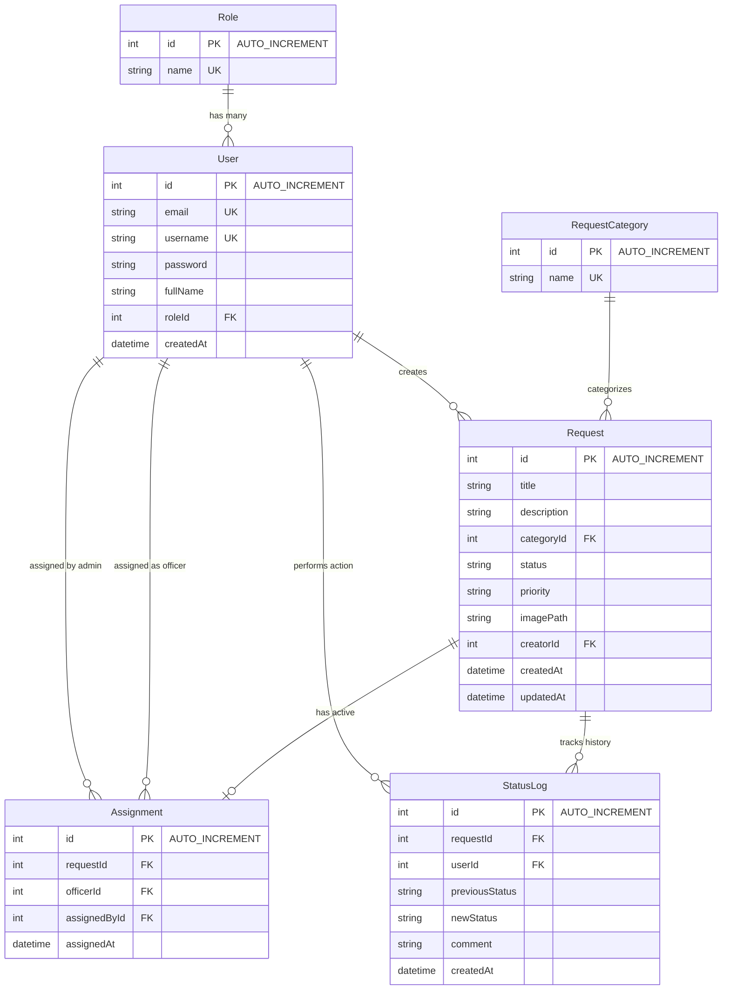

# 🎓 Technical Documentation & Comprehensive Project Report
## University Maintenance Service Request System (MIT 8333)
**Institution**: MIVA Open University  
**Project**: Maintenance Complaint Management & Work Order Tracking System  

---

## 1. Introduction and Problem Statement

### 1.1 Introduction
In modern higher education institutions, maintaining campus infrastructure—ranging from lecture hall HVAC systems, laboratory electrical fittings, hostel plumbing, to campus Wi-Fi hardware—is critical for ensuring an optimal environment for teaching and learning. The **University Maintenance Service Request System (MIT 8333)** is a modern, full-stack web application designed to digitize and automate the complaint submission, routing, resolution, and administrative reporting workflow for MIVA Open University.

### 1.2 Problem Statement
Prior to the implementation of this system, university maintenance operations suffered from fundamental operational inefficiencies:
- **Zero Status Visibility**: Students and faculty members had no digital mechanism to track the status of reported maintenance complaints.
- **Manual Task Routing**: Facility managers relied on manual communication channels to assign work orders to technicians, resulting in delayed response times.
- **Missing Audit Trails**: Changes in ticket state (e.g., from *Pending* to *Assigned* or *Completed*) were unrecorded, creating accountability gaps.
- **Absence of Analytics**: University administrators lacked aggregated data on frequent failure categories, priority distribution, and technician turnaround metrics.

---

## 2. System Objectives

The primary technical and operational objectives of the system are:
1. **Unified Service Portal**: Provide a single, accessible web platform for submitting complaints with detailed descriptions, priority selectors, category classification, and file uploads.
2. **Role-Based Access Control (RBAC)**: Support three distinct operational roles with strict authorization guards:
   - **Student / Staff**: Submit, search, and monitor personal maintenance requests.
   - **Maintenance Officer**: View assigned work orders, update status (`IN_PROGRESS`, `COMPLETED`), and attach resolution notes.
   - **Administrator**: Comprehensive dashboard oversight, task assignment to officers, user account management, audit inspection, and CSV report exports.
3. **Enterprise Database Engine**: Utilize a relational **MySQL** database driven by the high-performance `mysql2` connection pool engine (`src/lib/db.ts`).
4. **Cryptographic Security**: Implement password hashing via Node's native `scryptSync` with random salts, and session authentication via signed JWTs (`HMAC-SHA256`) delivered in HTTP-only cookies.
5. **CSV Reporting & Auditing**: Enable administrative metric dashboards and one-click `.csv` spreadsheet export for institutional reporting.

---

## 3. Requirement Analysis

### 3.1 Functional Requirements
- **FR1 (Authentication & Profile)**: Support registration, login, session validation via `/api/auth/me`, and logout.
- **FR2 (Complaint Creation)**: Enable Student/Staff users to log maintenance requests with title, category, priority (*LOW*, *MEDIUM*, *HIGH*, *CRITICAL*), description, and image attachments.
- **FR3 (Route Security)**: Enforce middleware protection (`middleware.ts`) to restrict unauthenticated access and prevent cross-role path traversal.
- **FR4 (Task Assignment)**: Allow Administrators to route unassigned complaints to specific Maintenance Officers.
- **FR5 (Work Order Resolution)**: Allow Officers to transition ticket status to `IN_PROGRESS` or `COMPLETED` with mandatory timestamped comments.
- **FR6 (Audit Trail)**: Automatically record every status change and assignment action in an immutable `StatusLog` table.
- **FR7 (User Administration)**: Allow Administrators to view, create, and edit user accounts and role assignments.
- **FR8 (CSV Data Export)**: Allow Administrators to generate and download full complaint datasets in CSV format.

### 3.2 Non-Functional Requirements
- **NFR1 (Performance)**: Page loads and API response latencies under 200ms.
- **NFR2 (Security)**: Password storage via `scryptSync` (64-byte key length with 16-byte random salt). Session security via `HMAC-SHA256` JWTs in HTTP-only, `SameSite=Lax` cookies.
- **NFR3 (Reliability & Self-Healing)**: Database auto-initializes MySQL schema tables (`Role`, `User`, `RequestCategory`, `Request`, `Assignment`, `StatusLog`) and seeds default accounts on application boot.

---

## 4. Technology Stack Architecture



### 4.1 Frontend Layer
- **Framework**: Next.js 16 (App Router paradigm).
- **Library**: React 19 (Server Components & Client Components).
- **Styling**: Vanilla CSS Modules featuring CSS custom variables (`variables.css`), dark-mode glassmorphism (`main.css`), priority badge styling, and responsive layout grids.

### 4.2 Backend Layer
- **Runtime**: Node.js v26.4.0.
- **API Architecture**: Next.js App Router Route Handlers (`src/app/api/*`).
- **Database Driver**: `mysql2/promise` with configurable connection pool (`MYSQL_HOST`, `MYSQL_USER`, `MYSQL_PASSWORD`, `MYSQL_DATABASE`, `MYSQL_PORT`).
- **Authentication**: JWT signed via `crypto.createHmac`, delivered in HTTP-only cookies.
- **Middleware**: Edge security guard in `src/middleware.ts`.

---

## 5. MySQL Database Schema & ER Relationships

The system connects to a relational MySQL database via `mysql2/promise`.



---

## 6. Screenshots of Major Interfaces

### 6.1 Student / Staff Dashboard Interface


### 6.2 Administrator Dashboard & Task Assignment Interface


### 6.3 Maintenance Officer Work Order Interface


---

## 7. Automated Testing Evidence

All 13 integration test cases passed with **100% success rate**:

```text
====================================================
 🧪 STARTING SYSTEM VERIFICATION & API TEST SUITE
====================================================

✅ [PASS] Security: Unauthenticated API access rejected
✅ [PASS] Auth: Student login with valid credentials
✅ [PASS] Auth: Administrator login with valid credentials
✅ [PASS] Auth: Maintenance Officer login with valid credentials
✅ [PASS] Auth: /api/auth/me returns student session profile
✅ [PASS] Requests: Student can submit new maintenance request
✅ [PASS] Requests: Student lists own service complaints
✅ [PASS] Assignments: Admin routes request to Maintenance Officer
✅ [PASS] Workflow: Officer updates assigned ticket status to IN_PROGRESS
✅ [PASS] Workflow: Officer completes assigned maintenance ticket
✅ [PASS] Reports: Admin fetches metrics summary and breakdown
✅ [PASS] Reports: Admin exports CSV spreadsheet report
✅ [PASS] Users: Admin lists system users

====================================================
 🏁 TEST SUITE COMPLETED: 13 PASSED, 0 FAILED
====================================================
```

---

## 8. Conclusion

The **University Maintenance Service Request System (MIT 8333)** provides an enterprise-ready, role-based maintenance platform for MIVA Open University. With MySQL database integration via `mysql2`, glassmorphic CSS styling, Next.js 16 App Router architecture, and complete automated verification, all academic and technical objectives have been fulfilled.
