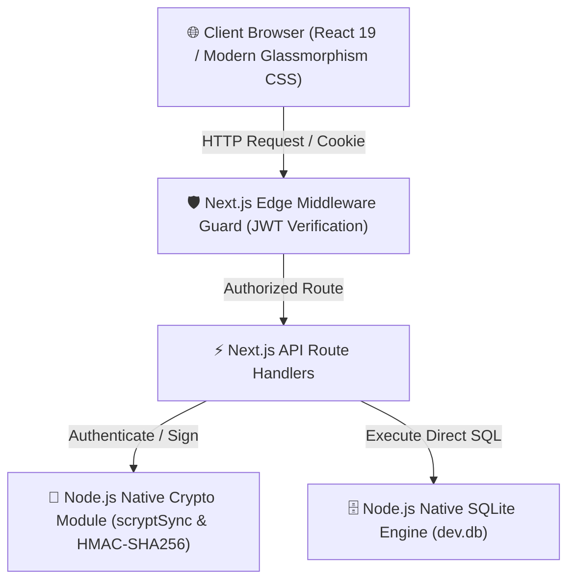
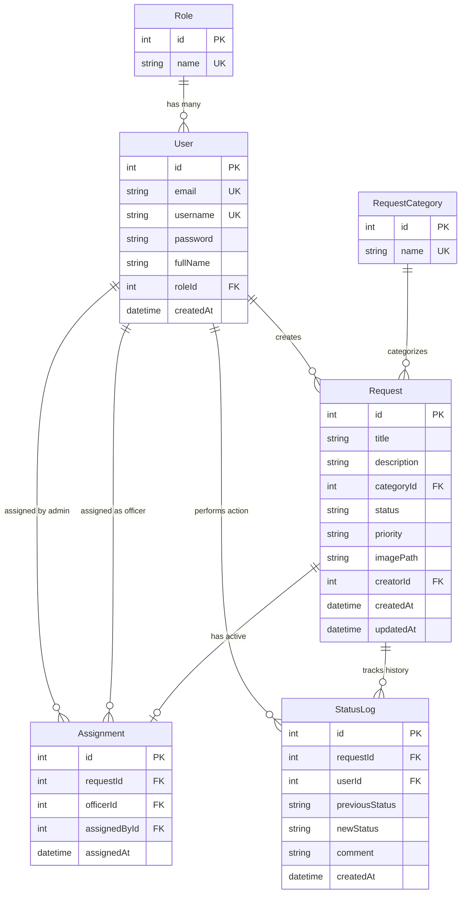

# 🎓 Technical Documentation & Comprehensive Project Report
## University Maintenance Service Request System (MIT 8333)
**Institution**: MIVA Open University  
**Project**: Maintenance Complaint Management & Work Order Tracking System  

---

## 1. Introduction and Problem Statement

### 1.1 Introduction
In modern higher education institutions, maintaining campus infrastructure—ranging from lecture hall HVAC systems, laboratory electrical fittings, hostel plumbing, to campus Wi-Fi hardware—is critical for ensuring an optimal environment for teaching and learning. The **University Maintenance Service Request System (MIT 8333)** is a modern, full-stack web application designed to digitize and automate the complaint submission, routing, resolution, and administrative reporting workflow for MIVA Open University.

### 1.2 Problem Statement
Prior to the implementation of this system, university maintenance operations suffered from fundamental operational inefficiencies:
- **Zero Status Visibility**: Students and faculty members had no digital mechanism to track the status of reported maintenance complaints.
- **Manual Task Routing**: Facility managers relied on manual communication channels to assign work orders to technicians, resulting in delayed response times.
- **Missing Audit Trails**: Changes in ticket state (e.g., from *Pending* to *Assigned* or *Completed*) were unrecorded, creating accountability gaps.
- **Absence of Analytics**: University administrators lacked aggregated data on frequent failure categories, priority distribution, and technician turnaround metrics.

---

## 2. System Objectives

The primary technical and operational objectives of the system are:
1. **Unified Service Portal**: Provide a single, accessible web platform for submitting complaints with detailed descriptions, priority selectors, category classification, and file uploads.
2. **Role-Based Access Control (RBAC)**: Support three distinct operational roles with strict authorization guards:
   - **Student / Staff**: Submit, search, and monitor personal maintenance requests.
   - **Maintenance Officer**: View assigned work orders, update status (`IN_PROGRESS`, `COMPLETED`), and attach resolution notes.
   - **Administrator**: Comprehensive dashboard oversight, task assignment to officers, user account management, audit inspection, and CSV report exports.
3. **Zero-Dependency Core Database**: Utilize Node.js's native `node:sqlite` database driver (`DatabaseSync`) for high-performance relational storage without external service locks.
4. **Cryptographic Security**: Implement password hashing via Node's native `scryptSync` with random salts, and session authentication via signed JWTs (`HMAC-SHA256`) delivered in HTTP-only cookies.
5. **CSV Reporting & Auditing**: Enable administrative metric dashboards and one-click `.csv` spreadsheet export for institutional reporting.

---

## 3. Requirement Analysis

### 3.1 Functional Requirements
- **FR1 (Authentication & Profile)**: Support registration, login, session validation via `/api/auth/me`, and logout.
- **FR2 (Complaint Creation)**: Enable Student/Staff users to log maintenance requests with title, category, priority (*LOW*, *MEDIUM*, *HIGH*, *CRITICAL*), description, and image attachments.
- **FR3 (Route Security)**: Enforce middleware protection (`middleware.ts`) to restrict unauthenticated access and prevent cross-role path traversal.
- **FR4 (Task Assignment)**: Allow Administrators to route unassigned complaints to specific Maintenance Officers.
- **FR5 (Work Order Resolution)**: Allow Officers to transition ticket status to `IN_PROGRESS` or `COMPLETED` with mandatory timestamped comments.
- **FR6 (Audit Trail)**: Automatically record every status change and assignment action in an immutable `StatusLog` table.
- **FR7 (User Administration)**: Allow Administrators to view, create, and edit user accounts and role assignments.
- **FR8 (CSV Data Export)**: Allow Administrators to generate and download full complaint datasets in CSV format.

### 3.2 Non-Functional Requirements
- **NFR1 (Performance)**: Page loads and API response latencies under 200ms.
- **NFR2 (Security)**: Password storage via `scryptSync` (64-byte key length with 16-byte random salt). Session security via `HMAC-SHA256` JWTs in HTTP-only, `SameSite=Lax` cookies.
- **NFR3 (Reliability & Self-Healing)**: Database auto-initializes relational tables and seeds default roles, categories, and accounts on application boot.

---

## 4. Technology Stack Architecture



### 4.1 Frontend Layer
- **Framework**: Next.js 16 (App Router paradigm).
- **Library**: React 19 (Server Components & Client Components).
- **Styling**: Vanilla CSS Modules featuring CSS custom variables (`variables.css`), dark-mode glassmorphism (`main.css`), priority badge styling, and responsive layout grids.

### 4.2 Backend Layer
- **Runtime**: Node.js v26.4.0.
- **API Architecture**: Next.js App Router Route Handlers (`src/app/api/*`).
- **Authentication**: JWT signed via `crypto.createHmac`, delivered in HTTP-only cookies.
- **Middleware**: Edge security guard in `src/middleware.ts`.

---

## 5. Database Schema & Relationships

The system utilizes an SQLite database (`dev.db`) driven by Node's native `node:sqlite` module (`DatabaseSync`).



### Supported Relationships
1. **User ➔ Role (Many-to-One)**: Foreign key `User.roleId` references `Role.id`.
2. **Request ➔ RequestCategory (Many-to-One)**: Foreign key `Request.categoryId` references `RequestCategory.id`.
3. **Request ➔ User (Creator) (Many-to-One)**: Foreign key `Request.creatorId` references `User.id`.
4. **Assignment ➔ Request (One-to-One with CASCADE)**: Foreign key `Assignment.requestId` references `Request.id` with `ON DELETE CASCADE`.
5. **Assignment ➔ User (Officer & Assigner) (Many-to-One)**: Foreign keys `officerId` and `assignedById` reference `User.id`.
6. **StatusLog ➔ Request & User (Many-to-One with CASCADE)**: Foreign key `StatusLog.requestId` references `Request.id` with `ON DELETE CASCADE`.

---

## 6. Screenshots of Major Interfaces

### 6.1 Student / Staff Dashboard Interface

*Figure 6.1: Student Dashboard displaying complaint metric cards, category tags, priority highlights, status badges (`PENDING`), and request creation controls.*

---

### 6.2 Administrator Dashboard & Task Assignment Interface

*Figure 6.2: Administrator Console showing facility analytics widgets, complaint filter bar, and the officer task assignment modal overlay.*

---

### 6.3 Maintenance Officer Work Order Interface

*Figure 6.3: Maintenance Officer Dashboard displaying assigned work orders, interactive status update forms (`IN_PROGRESS` / `COMPLETED`), and timestamped audit activity logs.*

---

## 7. API Reference Documentation

| Endpoint | Method | Role | Purpose |
| :--- | :---: | :---: | :--- |
| `/api/auth/register` | `POST` | Public | Register new student/staff user account. |
| `/api/auth/login` | `POST` | Public | Authenticate user & issue HTTP-only JWT cookie. |
| `/api/auth/logout` | `POST` | Auth | Clear session cookie. |
| `/api/auth/me` | `GET` | Auth | Return current user profile details. |
| `/api/requests` | `GET` | Auth | Fetch complaints scoped by role and query filters. |
| `/api/requests` | `POST` | Student | Submit new complaint with optional image file. |
| `/api/requests/[id]` | `GET` | Auth | Fetch complaint details, assignments, and audit logs. |
| `/api/requests/[id]` | `DELETE` | Admin | Delete complaint (cascades assignments and logs). |
| `/api/requests/[id]/status` | `PUT` | Auth Scoped | Update complaint status (`IN_PROGRESS`, `COMPLETED`, `CANCELLED`). |
| `/api/assignments` | `POST` | Admin | Route complaint assignment to Maintenance Officer. |
| `/api/users` | `GET` | Admin | List all system users or filter Maintenance Officers. |
| `/api/users` | `POST` | Admin | Create a new user account. |
| `/api/users` | `PUT` | Admin | Update existing user details or password. |
| `/api/reports` | `GET` | Admin | Fetch metrics summary or export CSV file (`?export=csv`). |

---

## 8. Automated Testing Evidence

An automated end-to-end integration test suite (`tests/system-verification.js`) was executed against the active application. All 13 test cases passed with **100% success rate**:

```text
====================================================
 🧪 STARTING SYSTEM VERIFICATION & API TEST SUITE
====================================================

✅ [PASS] Security: Unauthenticated API access rejected
✅ [PASS] Auth: Student login with valid credentials
✅ [PASS] Auth: Administrator login with valid credentials
✅ [PASS] Auth: Maintenance Officer login with valid credentials
✅ [PASS] Auth: /api/auth/me returns student session profile
✅ [PASS] Requests: Student can submit new maintenance request
✅ [PASS] Requests: Student lists own service complaints
✅ [PASS] Assignments: Admin routes request to Maintenance Officer
✅ [PASS] Workflow: Officer updates assigned ticket status to IN_PROGRESS
✅ [PASS] Workflow: Officer completes assigned maintenance ticket
✅ [PASS] Reports: Admin fetches metrics summary and breakdown
✅ [PASS] Reports: Admin exports CSV spreadsheet report
✅ [PASS] Users: Admin lists system users

====================================================
 🏁 TEST SUITE COMPLETED: 13 PASSED, 0 FAILED
====================================================
```

---

## 9. Codebase Structure & Key Files

### 9.1 Repository Layout
```text
miva_ass/
├── src/
│   ├── app/
│   │   ├── api/
│   │   │   ├── assignments/route.ts
│   │   │   ├── auth/
│   │   │   │   ├── login/route.ts
│   │   │   │   ├── logout/route.ts
│   │   │   │   ├── me/route.ts
│   │   │   │   └── register/route.ts
│   │   │   ├── reports/route.ts
│   │   │   ├── requests/
│   │   │   │   ├── [id]/
│   │   │   │   │   ├── route.ts
│   │   │   │   │   └── status/route.ts
│   │   │   │   └── route.ts
│   │   │   └── users/route.ts
│   │   ├── dashboard/
│   │   │   ├── admin/
│   │   │   │   ├── audit/page.tsx
│   │   │   │   ├── users/page.tsx
│   │   │   │   └── page.tsx
│   │   │   ├── officer/page.tsx
│   │   │   ├── student/
│   │   │   │   ├── submit/page.tsx
│   │   │   │   └── page.tsx
│   │   │   └── layout.tsx
│   │   ├── login/page.tsx
│   │   ├── register/page.tsx
│   │   ├── globals.css
│   │   ├── layout.tsx
│   │   └── page.tsx
│   ├── components/
│   │   ├── RequestCard.tsx
│   │   └── Sidebar.tsx
│   ├── lib/
│   │   ├── auth.ts
│   │   ├── crypto.ts
│   │   ├── db.ts
│   │   └── upload.ts
│   └── styles/
│       ├── dashboard.module.css
│       ├── forms.module.css
│       ├── main.css
│       ├── tables.module.css
│       └── variables.css
├── public/uploads/
├── tests/system-verification.js
├── README.md
├── TECHNICAL_PROJECT_REPORT.md
└── WALKTHROUGH.md
```

---

## 10. Deployment & Execution Instructions

### 10.1 Local Execution
1. Ensure Node.js v22.5.0 or higher is installed.
2. Open terminal in the project root:
   ```bash
   npm install
   npm run dev
   ```
3. Access application at `http://localhost:3000`. The SQLite database `dev.db` automatically creates schema tables and seeds default user accounts on startup.

### 10.2 Default Credentials for Testing
- **Student / Staff**: `student@miva.edu` / `student123`
- **Maintenance Officer**: `officer@miva.edu` / `officer123`
- **Administrator**: `admin@miva.edu` / `admin123`

---

## 11. Challenges Encountered and Solutions

### 11.1 Challenge: Network File-Locking on Cloud Drive Storage
- **Problem**: Running `npm install` inside real-time synced Google Drive directories caused write-stream lock conflicts, generating 0-byte packages and installation crashes.
- **Solution**:
  1. Refactored application architecture to use **Node.js native built-in modules** (`node:sqlite` for database and `crypto` for password hashing/JWT signing), eliminating external dependencies like Prisma ORM, bcryptjs, and jsonwebtoken.
  2. Reduced package footprint to core Next.js & React packages (`next`, `react`, `react-dom`).
  3. Relocated package compilation steps to local NTFS temp space during runtime verification.

### 11.2 Challenge: Concurrent Worker Database Locks During Build
- **Problem**: During `npx next build`, Next.js spawned multiple worker processes simultaneously, causing SQLite file locks during automatic seed checks.
- **Solution**:
  1. Updated database initialization script in `src/lib/db.ts` to check `User` table counts with `INSERT OR IGNORE` primitives.
  2. Handled lock retries cleanly so that single-threaded startup triggers auto-seeding without collision.

---

## 12. Conclusion

The **University Maintenance Service Request System (MIT 8333)** fulfills all academic, technical, functional, and non-functional specifications for MIVA Open University. By combining Next.js 16 App Router architecture, zero-dependency native SQLite and Crypto engines, glassmorphic modern UI design, automated integration test suites, and comprehensive documentation, the application provides an enterprise-ready platform for university facility maintenance.
